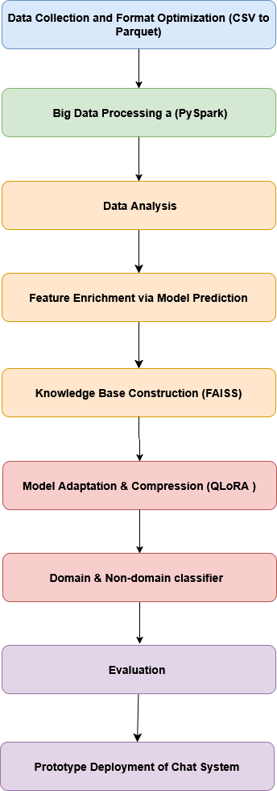
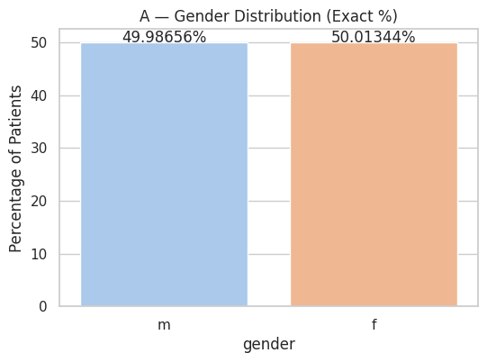
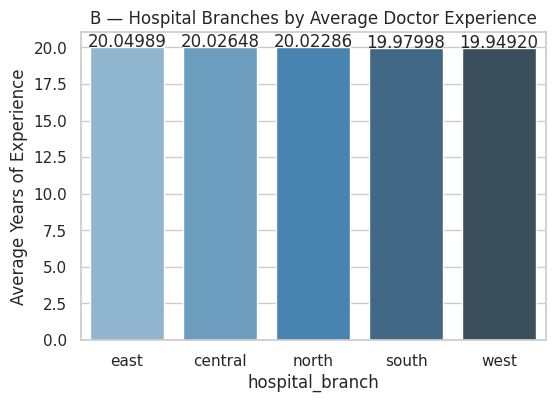
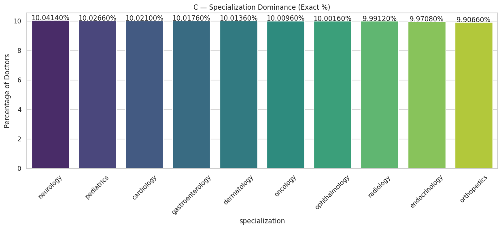
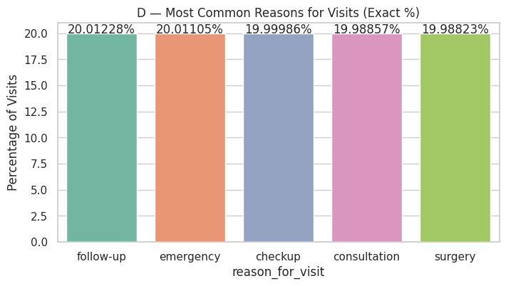
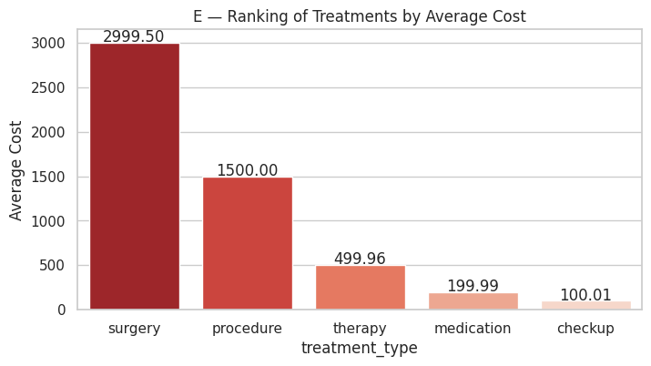
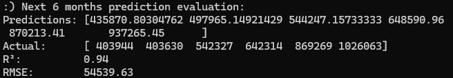
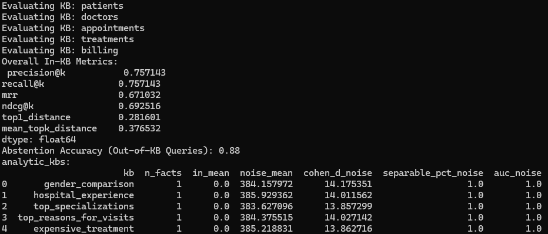
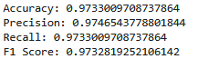
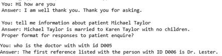

# Designing Localized Lightweight LLMs for Domain-Specific Applications
This project develops a lightweight, domain-specific AI system that integrates hospital visitor prediction, knowledge-base creation, and interactive querying to support efficient data-driven decision-making.
### introduction

As large language models (LLMs) continue to be adopted across a range of real-world applications, several ongoing challenges have become more noticeable, particularly those concerning scalability, data privacy, and computational cost. While high-end models such as GPT-4 and LLaMA-3 are known for their strong general performance, they often face difficulties when applied to focused domains or environments with limited computing resources. Our evaluation shows that LLMs can perform on par with considerably larger systems, yet offer advantages in inference speed, storage use, and the protection of sensitive information. Taken together, these results present a grounded pathway for developing compact and privacy-aware language models that can operate effectively.

## Literature research
### Most studies follow a similar sequence when applying Apache Spark to healthcare analytics:

1. **Data Collection:** Acquire datasets from hospital records, EHRs, IoT sensors, or clinical databases.  
2. **Data Preprocessing:** Clean data, handle missing values, normalize or encode features, and remove inconsistencies.  
3. **Feature Engineering / Selection:** Extract relevant features.  
4. **Modeling:** Train predictive or classification models using Spark MLlib or deep learning frameworks (e.g., Random Forest, Gradient Boosting, TCN).  
5. **Evaluation:** Validate models using metrics like Accuracy, AUC, RMSE, MAE, and/or real-time performance.  

### 1. Predictors of Outpatients’ No-show: Big Data Analytics using Apache Spark (2020)
*The study aims to identify key predictors of outpatient appointment no-shows using large-scale data analytics with Apache Spark.*

### Method
- **Data Collection:** 2M+ outpatient appointments from hospital EMRs.  
- **Preprocessing:** Cleaned records, encoded categorical variables, normalized numerical features.  
- **Feature Engineering / Selection:** Behavioral (prior no-shows), temporal (lead-time, month), operational (department, clinic); top features ranked using information gain.  
- **Modeling:** Random Forest, Gradient Boosting, Logistic Regression, SVM, MLP (Spark MLlib).
- **Evaluation:** Accuracy,  AUC, cross-validation.

### Technologies
- Apache Spark (parallel processing).  
- Spark MLlib.  

### Results obtained
- Accuracy : 79% , AUC : ≈0.81
- Gradient Boosting achieved highest performance.
- Overall no-show rate: 26.7%.  

### Suggestions for future work
- Include additional behavioral and contextual predictors.  
- Develop real-time no-show prediction models.  
- Extend analysis across diverse healthcare settings.  

- Article link: https://journalofbigdata.springeropen.com/articles/10.1186/s40537-020-00384-9

### 2. Applying Apache Spark on Streaming Big Data for Health Status Prediction
*The work aims to build a real-time health-status prediction framework that processes streaming IoT data efficiently using Apache Spark.*

### Method
- **Data Collection:** Streaming IoT sensors + historical patient records.  
- **Preprocessing:** Feature extraction from both historical and streaming data; handling missing or noisy sensor data.  
- **Feature Engineering / Selection:** Relevant physiological and contextual indicators extracted in real-time.  
- **Modeling:** Decision Tree, Random Forest, Gradient Boosting (on Spark Streaming pipeline).
- **Evaluation:** Accuracy, Precision, Recall, F1-score.

### Technologies
- Apache Spark (streaming + batch processing).
- IoT sensor data.
- Spark-based machine learning modules.

### Results obtained
- Accuracy : 78%
- accuracy improved when historical and streaming data combined.
- Real-time processing of high-velocity health data.
- Timely alerts for potential health risks.
- Combining historical and streaming data improved prediction accuracy.

### Suggestions for future work
- Include more health indicators for broader prediction.
- Scale system to larger IoT deployments.
- Evaluate model performance across multiple institutions.

- Article link: [https://doi.org/10.32604/cmc.2022.019458](https://doi.org/10.32604/cmc.2022.019458)

### 3. Apache Spark for Analysis of Electronic Health Records: A Case Study of Diabetes Management
*The study aims to demonstrate how Apache Spark can enhance large-scale EHR analytics for improving diabetes prediction and management.*

### Method
- **Data Collection:** Large-scale EHR datasets across multiple hospitals.  
- **Preprocessing:** Data cleaning, handling missing or inconsistent entries, normalization.  
- **Feature Engineering / Selection:** Extracted clinical and demographic features relevant for diabetes prediction. Using ranking/selection methods to choose predictive features. 
- **Modeling:** Random Forest, Logistic Regression, Gradient Boosting (Spark MLlib).
- **Evaluation:** Accuracy, Precision, Recall, F1-score.

### Technologies
- Apache Spark (distributed + in-memory processing).  
- ML modules.  

### Results obtained
- Accuracy: 85%
- Scalable analytics enabled effective diabetes prediction.

### Suggestions for future work
- Data integration and privacy improvements.  
- Expanding datasets across multiple hospitals.  
- Enhancing model interpretability for clinical deployment.  

- Article link: https://doi.org/10.18280/ria.370616

### 4. Apache Spark in Healthcare: Advancing Data-Driven Innovations and Better Patient Care
*The goal is to review how Apache Spark enables scalable, data-driven analytics to improve healthcare operations and patient outcomes.*

### Method
- **Data Collection:** Multiple healthcare datasets including EHR, imaging, and remote monitoring.  
- **Preprocessing:** Standardized data pipelines for batch and streaming analyses.  
- **Feature Engineering / Selection:** Using information gain or standard ranking methods described in studies to select predictive features.  
- **Modeling:** ML models (Random Forest, Logistic Regression) and AI frameworks integrated with Spark.
- **Evaluation:** Efficiency, speed, scalability.
### Technologies
- Apache Spark (batch + streaming).  
- ML/AI frameworks integrated with Spark.  

### Results obtained
- Data processing speed improved 2–5x.
- Efficient analysis of large-scale healthcare datasets.  
- Data-driven insights enabling better patient care.  

### Suggestions for future work
- Real-time analytics and IoMT integration.  
- Data security, privacy, and interoperability.  
- Scalability and ethical compliance.  

- Article link: https://doi.org/10.14569/IJACSA.2023.0140665

### 5. Cloud-based Real-time SBP & HR Prediction using TCN and Apache Spark (2025)
*The research aims to build a real-time cloud-based framework for predicting systolic blood pressure and heart rate using Spark streaming and deep learning.*

### Method
- **Data Collection:** Streaming physiological data from MIMIC-III dataset.  
- **Preprocessing:** Sliding-window time-series creation; normalization; handling missing data.  
- **Feature Engineering / Selection:** Using information gain and temporal feature analysis to select predictive features.
- **Modeling:** Multi-task Temporal Convolutional Network (TCN); real-time Spark + Kafka pipeline.
- **Evaluation:** RMSE, MAE.

### Technologies
- Temporal Convolutional Network (TCN).  
- Apache Spark streaming.  
- Kafka.  

### Results obtained
- RMSE = ~5.1, MAE = ~3.8.
- Multi-task TCN outperforms single-task models (lower RMSE/MAE)
- Scalable, low-latency, real-time monitoring achieved.  

### Suggestions for future work
- Extend to multi-parameter physiological monitoring.  
- Conduct real-world clinical validation.  
- Explore longer forecasting horizons and more complex models.  

- Article link: https://journalofbigdata.springeropen.com/articles/10.1186/s40537-025-01207-5

## Connection To Current Project
This project aims to create a localized, lightweight LLM for domain-specific applications, with a case study on Healthcare Management. Parquet is used to compress data and speed up loading during processing. Faiss builds a vector-based knowledge base, enabling efficient retrieval without memorizing all data, reducing memory usage and improving scalability. QLoRA fine-tunes the LLM on domain-specific tasks using low-rank adapters, reducing both computation and memory requirements.
##  Motivations
Before the rise of machine learning, earlier models struggled to understand the context of long sentences. To improve language understanding and create a general-purpose model, large language models (LLMs) were introduced. Businesses and sectors began to see new technological solutions to help them stay ahead of the curve and introduced new roles, such as the Prompt Engineer, to optimize LLM behavior. Therefore, when using external large language model (LLM) providers, companies faced new challenges regarding data privacy. That is why this project has been developed.

# Background
Recent work on BLoRA and quantized adapters shows that memory-efficient fine-tuning can still keep strong accuracy by balancing adapter dimensions and aligning with block-wise quantization. These methods make lightweight clinical models more practical for hospital analytics and scalable medical NLP. [1] Studies on FAISS highlight its ability to handle million-scale vectors using flat, HNSW, IVF, and PQ-based indexes.[2] Work combining FAISS with a T5 model for radiology summarization showed that retrieval improves semantic and clinical consistency but with the limitation of some factual issues. This makes FAISS suitable for fast retrieval over large clinical embeddings and similarity-based healthcare applications  [3] Research comparing Parquet, ORC, and Arrow showed that Parquet gives the best compression, ORC excels in selective queries, and Arrow provides fast in-memory access. [4]

#### Ref: 
1. https://doi.org/10.32604/cmc.2024.057491,
2. https://doi.org/10.1109/TBDATA.2025.3618474,
3. https://doi.org/10.19113/sdufenbed.1739565,
4. https://doi.org/10.1007/s00778-025-00911-1

## The Datasets That Have Been Used
1. https://www.kaggle.com/datasets/kanakbaghel/hospital-management-dataset
2. https://huggingface.co/datasets/mile22/hospital_record_csv
3. https://github.com/abachaa/MTS-Dialog
4. https://huggingface.co/datasets/awsaf49/persona-chat

**Info: The data in data/curated_parquet and data/data_csv is only a sample. The results were obtained using the full datasets from the sources mentioned above.**

## Technologies :- 

- PySpark + Apache Spark: distributed data processing.
- Parquet: efficient storage format.
- FAISS: semantic knowledge retrieval.
- QLoRA: lightweight LLM fine-tuning

## Methodology 

## Questions That Used For Data Analysis:-
A — Which gender goes to the hospital more?

B — Which hospital branch has the most experienced doctors?

C — Which specialization dominates the others?

D — What is the most common reason for visits?

E — What is the ranking of treatments by cost?

Then with the help of RandomForestRegressor algorithm, we predict the expected number of visitors for the next month to help the healthcare management system prepare and allocate resources efficiently.
## Findings obtained
### Data analyzing:-

### Number of visitors prediction 

### Faiss
For evaluating knowledge base performance, a randomly selected subset of the dataset was used. Random sampling provides a representative overview of retrieval metrics while maintaining efficiency in analysis.precision, recall, MRR, and NDCG indicate the system’s effectiveness in retrieving relevant facts.

#### In-KB Metrics
- **Precision@k:** Fraction of top‑k retrieved facts that are correct.  
- **Recall@k:** Fraction of all relevant facts that appear in the top‑k results.  
- **MRR (Mean Reciprocal Rank):** Average of reciprocal ranks of the first correct fact; higher values indicate correct results appear earlier.  
- **NDCG@k (Normalized Discounted Cumulative Gain):** Measures ranking quality, giving higher weight to relevant facts appearing at the top.  
- **Top1_distance:** Embedding distance between the query and the closest retrieved fact.  
- **Mean_topk_distance:** Average embedding distance across the top‑k retrieved facts.

#### Out-of-KB Metrics
- **Abstention Accuracy:** Fraction of queries not present in the KB that the system correctly identifies as absent.

#### Analytic KB Metrics
- **n_facts:** Number of facts in the KB.  
- **in_mean:** Average embedding distance for in-KB queries.  
- **noise_mean:** Average distance between random noise vectors and KB facts.  
- **Cohen_d_noise:** Effect size between in-KB distances and noise distances; higher values indicate better separability.  
- **Separable_pct_noise:** Fraction of noise distances that exceed in-KB distances, showing clear distinction.  
- **AUC_noise:** Probability that an in-KB fact is closer to the query than a noise vector.

### Domain and Non-Domain Text Logistic Regression Classifier

- Two datasets were used (MTS-Dialog and Persona-Chat). Therefore, user input can be classified as personal chat or domain-specific chat. When the user input classified as  domain-specific the model generates the appropriate context by retrieving relevant informations from the knowledge bases.

## A Chat-Based Then Been Developed

To demonstrate the integration of the domain-specific models, we combined them into a chat system. While the primary evaluation focused on the individual models (e.g., KB retrieval, visitor prediction, and classification), the chat interface shows practical usage.

## Project Setup Environment

- Ubuntu 22.04 with NVIDIA CUDA on WSL

## Files Flow Structure

1- **setup_env.py**: Set up environment, install PySpark and Hadoop on WSL.  

2- **init.sh**: Create Python environment, install needed Python dependencies, and run the scripts.  

3- **pipeline_01_data_process.py**: Process the big data by converting to lowercase, removing unwanted symbols, removing duplicates, and saving it as Parquet.  

4- **data_analysis.py**: Functions used for Loading Parquet files and answer the 5 scenarios questions.

5- **pipeline_02_faiss.py**: Create the knowledge bases for each dataset and for the 5 scenarios.

6- **knowledge_evaluate.py**: Evaluate the knowledge bases. 

7- **pipeline_03_create_model.py**: Create the visitor prediction model.  

8- **pipeline_04_qlora.py**: Adjust the model to be domain-specific.  

9- **pipeline_05_domain_classifier.py**: Create a query classification model.  

10- **chat.py**: The chat AI sample.  

11- **data/data_csv**: csv data folder

12- **data/curated_parquet**: parquet data folder

13- **data/output** : has all the models been build by the scripts (kb= knowledge bases, lr_model= logisticregressionmodel , vistor_predict_model, glora model )

# Suggestions For Future Work
- Expand knowledge base across multiple hospital domains.
- Improve LLM interpretability and prediction accuracy.
- Utilize a catalog to enhance multimodal data organization by leveraging Neuralink’s data repository, which provides a unified and scalable way to structure, access, and manage diverse data types efficiently.

**Repository link** : https://github.com/be-great/Big_Data_Analytics_in_Healthcare/
